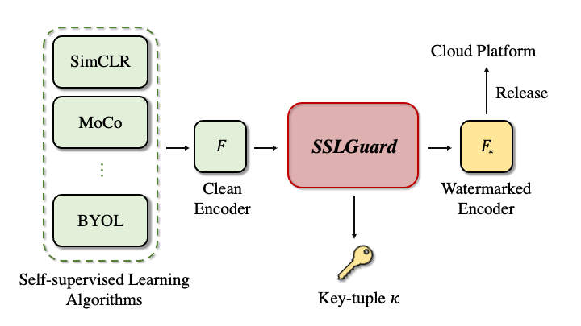

# SSLGuard

This repository contains the PyTorch implementation of SSLGuard, which aims to protect the copyright of the self-supervised learning pre-trained encoders.
SSLGuard contains two process: watermark injection and extraction.
The workflow is shown as following:

<div align="center">

</div>

## Citation
Please cite our paper if you use this code in your own work:

```
@inproceedings{CHZ22,
author = {Tianshuo Cong, Xinlei He and Yang Zhang},
title = {{SSLGuard: A Watermarking Scheme for Self-supervised Learning Pre-trained Encoders}},
booktitle = {{ACM SIGSAC Conference on Computer and Communications Security (CCS)}},
publisher = {ACM},
year = {2022}
}
```

## Pre-trained SSL encoders (clean)
The checkpoints of the clean encoders we used in our paper are [here](https://drive.google.com/drive/folders/1xKZl-C7KxUz_nVa4bEAJ6FUfIUs_425h?usp=sharing). 
All the checkpoints we download from the official website or the public platform :
- SimCLR (ResNet-50 (1x)) : https://github.com/google-research/simclr (We also use the code in https://github.com/tonylins/simclr-converter)
- MoCo v2 : https://github.com/facebookresearch/moco (800 epochs)
- BYOL : https://github.com/yaox12/BYOL-PyTorch (300 epochs) 

## Injection process
- victim = ["simclr", "moco", "byol"]
- model-dir: save the key-tuple and watermarked encoder
```
python embed.py --victim simclr --epochs 50 --seed 1 --r 0.65 --model-dir [SAVE_PATH] --log-dir [LOG_PATH] --log-name [LOG_NAME]
```

## Verification
```
python verify.py --ssl byol --embed-path [Watermarked_encoder_path] --sk [sk_path] --mask [mask_path] --trigger [trigger_path] --dec [decoder_path]
```

## Train downstream classifier
- ssl = ["simclr", "moco", "byol"]
- task = ["stl10", "cifar10", "mnist", "fashion-mnist"]
- ch = ["clean", "surrogate", "embed"]
```
python classifier.py --ch clean --ssl byol --task stl10 --log-dir [LOG_PATH]  --log-name [LOG_NAME]
```

